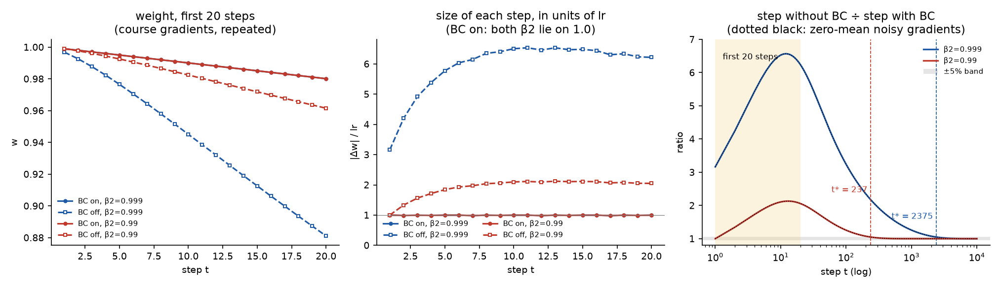
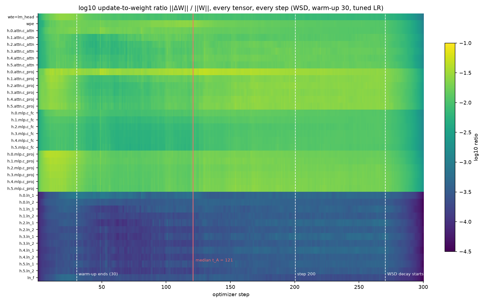
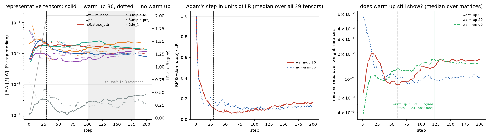
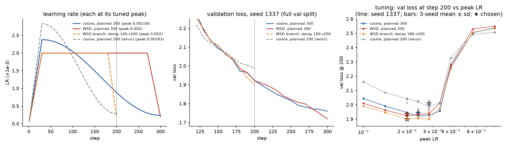
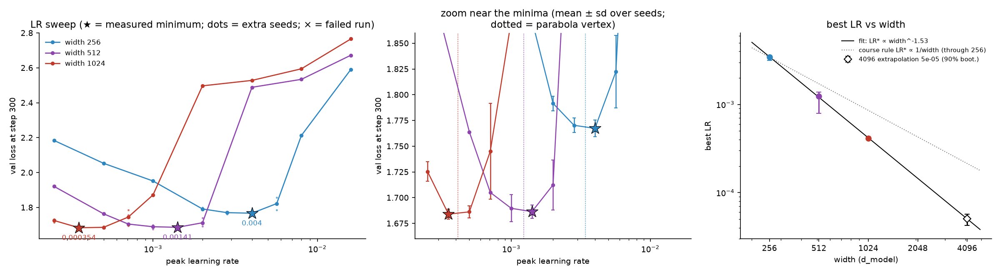

# Optimizers and learning-rate schedules, measured on a small GPT

Built as ERA V5 Session 11 assignment. Comparisons with "the notes" below refer to that session's course notes, which supply the worked examples and rules of thumb I tested.

Everything below was run on the same small GPT I used in my training-loop audit (`training-loop-audit`; nanoGPT, character-level Tiny Shakespeare, 6 layers, 384 wide, 10.7M parameters), plus three width variants of it for the learning-rate sweep. Experiments 1 and 2 are pure arithmetic on one weight and run on a CPU. Experiments 3 to 5 are 108 short training runs on Modal GPUs, plus 2 timing runs (about 0.8 GPU-hours, $1.05 in total).

Each number in this file comes from a file in `results/`. Each figure is regenerated by a script in `analysis/` or by `adam_by_hand.py`.

## Short answers

| Question | What I measured |
|---|---|
| Adam by hand, five gradients, vs PyTorch | Every intermediate (m, v, both bias-correction denominators, m̂, v̂, denominator, step, weight) matches `torch.optim.Adam` to **4.8e-17** in float64 and **2.2e-8** in float32. It also matches an exact rational recomputation and the notes' printed table. |
| Bias correction off, first 20 steps | The uncorrected step is **3.16×** the corrected one at step 1, rises to **6.57×** at step 12 and is still **6.24×** at step 20 (β2 = 0.999). It does not stop mattering inside 20 steps. Under my pre-set criterion (step size within 5% for 10 consecutive steps) it stops mattering at step **2,375** for β2 = 0.999 and step **237** for the β2 = 0.99 my GPT uses. The weight gap it leaves behind never closes. |
| Update-to-weight ratio, every layer, through warm-up | Logged for all 39 tensors at every step. Warm-up is configured to end at step 30, but the ratio peaks at step 15, dips to a trough at step 60, and settles only around **step 120** (median over tensors, ±20% criterion). Compared with no warm-up the effect never wears off: without warm-up the model never left the loss plateau (3 seeds). |
| Cosine vs WSD, planned 300 steps, stopped at 200 | Val loss at step 200: cosine **1.945 ± 0.020**, WSD **1.936 ± 0.012** (3 seeds each, both tuned). The difference is inside run-to-run noise, so this is a tie. I would keep the **WSD** checkpoint because it can be continued or finished: a 20-step decay branch reaches **1.900** at the same compute. |
| LR sweep at widths 256 / 512 / 1024 | Best LR **3.4e-3 / 1.2e-3 / 4.1e-4** (parabola vertex; best grid points 4e-3 / 1.41e-3 / 3.54e-4). The best LR falls as **width^-1.53**. |
| LR for width 4096 | **5e-5.** Confidence is low to moderate: I would expect the true optimum within a factor of 2 of this and would check 3.5e-5 / 5e-5 / 7e-5 before a long run. |

## The model, the data, and what was held fixed

`s11lab/model.py` and `s11lab/data.py` are byte-for-byte copies of the `s10lab/` files from the training-loop audit (SHA-256 `014f8cce…` and `a5ba1e10…`). I re-read them before reusing them and found nothing to fix. That project's training loop was rewritten into `s11lab/runner.py` rather than copied. I needed per-step parameter snapshots, branchable runs, and batches that do not depend on the model, but its conventions are kept.

| | |
|---|---|
| Architecture | nanoGPT: pre-LN blocks, GELU MLP (4×), tied `wte`/`lm_head`, no biases, no dropout, N(0, 0.02) init with residual projections at 0.02/√12 |
| Depth / heads | 6 layers, head dim 64 (6 heads at width 384; 4 / 8 / 16 heads at 256 / 512 / 1024) |
| Parameters | 4,804,096 (256), **10,745,088 (384, the base model)**, 19,045,376 (512), 75,839,488 (1024) |
| Data | Tiny Shakespeare, character-level, 65 symbols, first 90% train / last 10% validation |
| Context, batch | 256 positions, 32 sequences × 2 micro-batches = 16,384 tokens per optimizer step |
| Optimizer | AdamW (fused), β = (0.9, 0.99), ε = 1e-8, weight decay 0.1 on tensors with ≥2 dims only, grad clip 1.0 |
| Precision | bf16 autocast, fp32 master weights, TF32 off |
| Validation | the whole validation split in 435 non-overlapping windows (111,360 tokens), so val loss has no sampling noise |
| "Train loss" | two numbers: loss on a fixed 128-sequence train subset (32,768 tokens), and the mean minibatch loss over the last 10 steps |
| Seeds | one seed sets both the init and the batch order. Batches are a pure function of (seed, step), so two runs with the same seed see identical tokens; every run records a running hash of its batch indices |

Two differences from the training-loop audit are deliberate. The runs are 300 steps instead of 1,500, because the study fixes a 300-step horizon. Warm-up is 30 steps (10%). The notes' 2% would be 6 steps on a 300-step run, which is too short to see anything, and I also ran warm-up 0 and 60 as controls.

One property of this setup matters for interpretation: 300 steps is **4.9 passes** over the 1.0M-character training split. The models are small, but the runs are multi-epoch and partly data-limited (width 1024 ends with train 1.47 against val 1.68).

GPU runs used Modal with `gpu="A10G"`. The device reported at runtime was "NVIDIA A10G" for 69 jobs and "NVIDIA A10" for 41. Nothing here is a throughput claim, so the mix only matters through run-to-run nondeterminism, which I measured (below).

## 1. Adam by hand

The weight, gradients and hyperparameters are the notes' worked example: w₀ = 1, gradients 0.50, 0.40, 0.60, 0.45, 0.55, η = 0.001, β1 = 0.9, β2 = 0.999, ε = 1e-8. `adam_by_hand.py` computes each step in plain Python floats with no torch import in that path:

| t | g | m | v | 1-β1ᵗ | 1-β2ᵗ | m̂ | v̂ | √v̂+ε | step | w |
|---|---|---|---|---|---|---|---|---|---|---|
| 1 | 0.50 | 0.050000 | 0.00025000 | 0.100000 | 0.001000 | 0.500000 | 0.250000 | 0.500000 | -0.001000000 | 0.999000000 |
| 2 | 0.40 | 0.085000 | 0.00040975 | 0.190000 | 0.001999 | 0.447368 | 0.204977 | 0.452744 | -0.000988126 | 0.998011874 |
| 3 | 0.60 | 0.136500 | 0.00076934 | 0.271000 | 0.002997 | 0.503690 | 0.256703 | 0.506659 | -0.000994140 | 0.997017734 |
| 4 | 0.45 | 0.167850 | 0.00097107 | 0.343900 | 0.003994 | 0.488078 | 0.243132 | 0.493084 | -0.000989847 | 0.996027887 |
| 5 | 0.55 | 0.206065 | 0.00127260 | 0.409510 | 0.004990 | 0.503199 | 0.255030 | 0.505004 | -0.000996425 | 0.995031463 |

To avoid checking my arithmetic against itself, I verified it two other ways.

- **PyTorch.** The gradient arrives through `loss = g·w; loss.backward()`. m and v are read from `optimizer.state` (`exp_avg`, `exp_avg_sq`), m̂ and v̂ are formed from PyTorch's own step counter, and the step is the observed change in the parameter.
- **A non-recursive closed form.** m_t = (1-β1) Σ β1^(t-i) g_i in exact rational arithmetic (`fractions`), with a 50-digit square root.

| by hand vs | largest absolute difference over all 9 quantities and 5 steps |
|---|---|
| exact closed form | 3.3e-15 |
| `torch.optim.Adam`, float64 (single-tensor and foreach paths) | 4.8e-17 |
| `torch.optim.Adam`, float32 | 2.2e-8 |

All of these are asserted in the script, along with the notes' table at the precision it was printed (`results/adam_by_hand.json`, per-quantity comparison in `results/adam_vs_pytorch.csv`). The steps come out between 0.988η and 1.000η while the gradients range from 0.40 to 0.60. That is the point of the notes' table. (Step 2 is 1.2% short of η, slightly more than the "within half a percent" in the notes' prose, but the notes' own table also shows 0.000988.)

## 2. Bias correction switched off

I fixed the criterion before computing anything. Let u_t be the change in the weight at step t. The difference *stops mattering* at the first step t* for which |u_t(no BC) − u_t(BC)| / |u_t(BC)| < 5% holds for 10 consecutive steps. I judge it on the step rather than on the weight because the weight gap is cumulative and does not close (shown below).

Both versions start from the same w₀ with m = v = 0, see the same gradients (the five above, repeated), and have identical m and v at every step (asserted). The only difference is whether m and v are divided by (1-βᵗ). There is no weight decay on a single scalar, so this is plain Adam; bias correction and AdamW's decoupled decay are separate mechanisms.



| | β2 = 0.999 (notes, PyTorch default) | β2 = 0.99 (my GPT runs) |
|---|---|---|
| uncorrected / corrected step at t = 1 | 3.162 | 1.000 |
| largest ratio in the first 20 steps | 6.57 (t = 12) | 2.13 (t = 13) |
| ratio at t = 20 | 6.24 | 2.06 |
| stopped mattering within 20 steps? | no | no |
| **t\*** (5%, 10 steps) | **2,375** | **237** |
| t* at 10% / 2% / 1% | 1,751 / 3,247 / 3,925 | 175 / 324 / 391 |
| t* with a 5- or 20-step window | 2,375 / 2,375 | 237 / 237 |
| extra distance travelled without BC, after 20 steps | 0.099 (w = 0.881 instead of 0.980) | 0.019 |
| same, after 10,000 steps | 1.20 | 0.082 |

Things I did not expect before running this:

- **Without correction the first step is too big, and later steps get bigger still.** m catches up within about 10 steps, but v needs about 1,000 steps at β2 = 0.999. So the ratio of the two corrections, (1-β1ᵗ)/√(1-β2ᵗ), climbs to 6.6 before it falls. The 3.16η at step 1 in the notes is the mildest point of the first 20.
- **The answer does not depend on the gradients.** I repeated everything with zero-mean Gaussian gradients (dotted lines) and got the same t* to the step. When both runs share m and v, the step ratio is exactly (1-β1ᵗ)(√v̂+ε)/(√v+ε), which is gradient-free apart from ε. The audit script checks t* against that closed form. So the step count belongs to β1, β2 and my 5% threshold, not to the gradient sequence.
- **β2 = 0.99 brings this into range of my own runs.** With β2 = 0.99, t* = 237 lies inside a 300-step run. On the real model (WSD, peak 2e-3, warm-up 30), switching bias correction off raised the step-300 val loss from 1.715 to **1.891** (3-seed means; per seed 1.978 / 1.747 / 1.949). One seed nearly got away with it. Warm-up hides part of the problem: the 2× oversize steps fall where the LR is still small.

## 3. Update-to-weight ratio for every layer, through warm-up

**Definition.** For every parameter tensor W, at every step, r_t = ‖W_t − W_{t−1}‖_F / ‖W_{t−1}‖_F. W is copied right before `opt.step()` and compared right after, so r is the update AdamW actually made, decoupled decay included. It is not the gradient norm and not lr·g. A test re-measures it independently. Separately, I log the RMS of Adam's own part of the step divided by the LR. That is the "fraction of η" the notes talk about, and the decay term (lr·0.1·W) is removed from it.

**Tensors.** The model has no biases, so there are 39 tensors. Each block has `ln_1`, `attn.c_attn` (QKV), `attn.c_proj`, `ln_2`, `mlp.c_fc` and `mlp.c_proj`, and there are six blocks. Add the tied `wte = lm_head`, the position table `wpe`, and `ln_f`. I never average across them; families are summarised by their median.

**Run.** The WSD run from experiment 4 at its tuned peak 2e-3 (seed 1337), with control runs that differ only in warm-up (0 and 60) and in bias correction. All controls start from the same weights and see the same batches (asserted).





What the logs show:

**Step 1 is exactly the notes' calculation.** Adam's first step is ±η in every coordinate, so r₁ = η₁ / RMS(W₀). With η₁ = 2e-3/30, that gives 3.3e-3 for the 0.02-initialised matrices, 1.15e-2 for the residual projections (init 0.02/√12), and 6.7e-5 for the LayerNorm gains (init 1). The audit checks all 39 against this formula (largest deviation 2.4%). Without warm-up the step-1 ratio is 30 times larger: **0.10** for most matrices and **0.35** for the residual projections. That is the notes' 0.0003/0.0156 = 0.019 argument, and in my model it is 18 times worse.

**The families differ by about 50×.** In the stable phase (median of steps 100 to 180) the ratio is 1.9e-2 for both residual projections (`attn.c_proj`, `mlp.c_proj`), 1.5e-2 for QKV, 1.0e-2 for `mlp.c_fc` and `wte`, 1.75e-2 for `wpe`, and 3.1e-4 for the LayerNorm gains. A single network-wide average would mostly report the LayerNorms' absence.

**Against the course's 1e-3 reference, the matrices sit about 15× higher.** They are near 1.5e-2 for the whole flat phase and drop to about 1.6e-3 once the WSD decay ends. The reason is the operating point: ratio ≈ η × (Adam step / η) / RMS(W) ≈ 2e-3 × 0.13 / 0.02. The learning rate here was chosen by a 300-step sweep, which favours large LRs (experiment 4). The 1e-3 figure belongs to a long run at a much larger width, so I am reporting the discrepancy rather than forcing the number.

**What warm-up does over time.** First row: the median ratio over the 26 matrices (everything except the LayerNorm gains). Second row: Adam's step in units of η, median over all 39 tensors. Last row: the LR.

| step | 1 | 5 | 10 | 15 | 20 | **30 (warm-up ends)** | 40 | 60 | 90 | 100 | 150 | 200 |
|---|---|---|---|---|---|---|---|---|---|---|---|---|
| ratio | 3.3e-3 | 9.7e-3 | 1.7e-2 | **2.1e-2** | 1.9e-2 | 1.6e-2 | 9.4e-3 | **7.9e-3** | 1.15e-2 | 1.5e-2 | 1.6e-2 | 1.65e-2 |
| Adam step / η (all 39) | 1.00 | 0.42 | 0.33 | 0.24 | 0.18 | 0.11 | 0.080 | 0.066 | 0.082 | 0.099 | 0.13 | 0.16 |
| LR | 6.7e-5 | 3.3e-4 | 6.7e-4 | 1.0e-3 | 1.3e-3 | 2e-3 | 2e-3 | 2e-3 | 2e-3 | 2e-3 | 2e-3 | 2e-3 |

The second row is the notes' warm-up story, measured. At step 1 every weight takes the full η because the gradients all agree. By step 30 Adam's step has fallen to about 0.1η as they decorrelate, and it bottoms out at 0.061η at step 61 (`results/update_ratio_summary.json`). During warm-up the LR rose 30× while Adam's own step fell about 9×, so the ratio **peaked at step 15, half-way through warm-up**, and was already falling when warm-up ended.

**So when does warm-up stop changing it?** It starts changing it at step 1, as above. Configured end: step 30. Measured, with criteria I fixed before the control runs existed:

- *A, within the run*: the first step after which the 9-step median stays within ±20% of its steps-100-to-180 level through step 180. The median over tensors is **step 121**. Per tensor it ranges from 57 to 177; 13 tensors, mostly LayerNorm gains, never settle that tightly. At ±30% the median is 96.5, at ±10% it is 146. By family: tied embedding 57, QKV 100.5, MLP down 121, MLP up 124, `wpe` 129, attention out-projection 153.
- *B, against the no-warm-up run*: for 25 of 39 tensors the two never agree within 1.2× before step 180. This is not noise. **Without warm-up the run never left the loss plateau at ~2.5** (val loss at step 300: 2.481 / 2.478 / 2.488 on three seeds, against 1.718 / 1.712 / 1.714 with warm-up). On this model warm-up changed the run permanently, not for a few dozen steps.
- *B2, added after seeing B (post hoc)*: warm-up 30 against warm-up 60, two runs that both train normally. They agree from a median of **step 124** (20%), or step 76 at 30%. Warm-up 60 ended slightly better at step 300: 1.705 against 1.715, 3-seed means.

My answer is therefore about **step 120, four times the configured warm-up**. The ratio changes in two phases after step 30. From 30 to 60 it falls, as Adam's step keeps shrinking at constant LR; that phase is the tail of the warm-up transient. From 60 to 100 it rises again, as the model starts to leave the plateau. The rise comes before the loss moves: between steps 60 and 100 the median ratio nearly doubles (7.9e-3 to 1.5e-2) while val loss only goes from 2.48 to 2.42; the fast drop to 2.11 happens between 100 and 150. This is the same pattern as the grad norm moving before the loss in the training-loop audit, seen in a different diagnostic. I only have this timing for one seed, so I would not lean on it.

Controls, three seeds each (val loss at step 300, peak LR 2e-3, WSD):

| warm-up | bias correction | val@300 per seed | mean | largest ratio, any tensor, first 50 steps |
|---|---|---|---|---|
| 30 | on | 1.718 / 1.712 / 1.714 | 1.715 | 0.039 to 0.042 |
| 60 | on | 1.700 / 1.705 / 1.709 | 1.705 | 0.028 to 0.034 |
| 0 | on | 2.481 / 2.478 / 2.488 | 2.482 | 0.347 |
| 30 | off | 1.978 / 1.747 / 1.949 | 1.891 | 0.071 to 0.079 |
| 0 | off | 2.519 / 2.544 / 2.571 | 2.545 | 0.346 |

One seed without warm-up had a grad-norm spike to 5,443 in the first 50 steps. The other two peaked at 17 and 14, so the spike is not the whole story; the plateau failure happened every time.

Full per-step, per-tensor data: `results/update_ratio_main_run_every_step.csv`; per-tensor criteria: `results/update_ratio_per_tensor.csv`.

## 4. Cosine vs WSD, planned for 300 steps, stopped at step 200

Both runs use the base model, start from identical weights, and see identical batches (init and batch hashes asserted per seed). Both warm up for 30 steps and are planned for 300 steps. Cosine decays from step 30 to 0.1× peak at step 300. WSD stays flat until step 270 and then decays linearly to 0.1× peak at step 300. Both are stopped at step 200, where cosine has already come down to 37% of its peak (8.85e-4) and WSD is still flat at its peak (2e-3).

**Tuning, the same for both.** Seed 1337 over the same nine peak LRs (1e-3 to 8e-3 in √2 steps, plus 2.38e-3 and 3.36e-3 near the optimum). Then two more seeds at the three LRs around the optimum (2e-3, 2.38e-3, 2.83e-3) for both schedules. Each schedule keeps the LR with the lowest **3-seed mean validation loss at step 200**. That makes 15 runs per schedule. Warm-up, minimum LR, betas, decay, clipping and data are shared and not tuned.

- Cosine chose 2.38e-3 and WSD chose 2e-3. Neither sits at the edge of the grid.
- Selecting on seed 1337 alone, or on step-300 loss, gives the same two LRs.
- From 4e-3 up both schedules degrade sharply, in the same way; from 5.66e-3 the runs are still on the ~2.5 plateau at step 300.



Step 200, each schedule at its tuned LR, 3 seeds:

| | val loss | train loss (fixed subset) | train loss (minibatch, steps 191 to 200) | LR at step 200 |
|---|---|---|---|---|
| cosine (planned 300) | **1.9446 ± 0.0198** | 1.7931 | 1.8336 | 8.85e-4 |
| WSD (planned 300) | **1.9355 ± 0.0118** | 1.7758 | 1.8120 | 2.0e-3 |
| WSD − cosine, paired by seed | −0.0091 ± 0.0102 (−0.0076, +0.0002, −0.0200) | | | |

I do not read this as a WSD win. As a check I re-ran the two chosen configurations with a literal `stop_step = 200`. I saved the step-200 checkpoints, reloaded them, and re-evaluated them on a GPU; the val loss, weight hash and optimizer step count all matched. Those reruns gave **cosine 1.9166 and WSD 1.9309**, so the order flips. The reruns differ from their same-seed tuning runs by 0.0055 (cosine) and 0.0087 (WSD). Inputs, init and batches are identical, so this is GPU nondeterminism (non-deterministic kernels, and a mix of A10 and A10G hosts), most likely amplified by the plateau escape. That run-to-run spread is as large as the gap between the schedules, so **at step 200 the two are tied**.

Other measurements around the step-200 point:

| | val loss | note |
|---|---|---|
| WSD branch: from the step-180 checkpoint, decay over steps 181 to 200 | **1.8997 ± 0.0009** | same compute and batches as the stopped runs; better than stopped cosine on every seed (−0.045 ± 0.020) |
| WSD step-200 checkpoint, finished with a 22-step decay | 1.8452 at step 222 | the actual step-200 checkpoint, branched |
| cosine planned for 200 steps from scratch (tuned on the same grid, best 2.83e-3) | 2.0105 ± 0.0204 | **worse** than the stopped 300-step cosine on every seed (+0.066) |
| at step 300 (runs continued): WSD vs cosine | 1.7148 vs 1.7689 | WSD lower on every seed (−0.054) |

The cosine-200 row contradicts what I expected from the notes ("worse than one trained to that shorter length deliberately"). My reading is that in a 300-step run that is still leaving a plateau, total learning-rate area matters more than finishing the anneal. A cosine planned for 200 steps starts shrinking the LR immediately, and it pays for that. I would not generalise this to long runs.

**Which model I would keep: the WSD checkpoint from step 200.** Its loss is no better than cosine's; that comparison is a tie. I would keep it for the operational property the session is about. Its optimizer and LR state are in the flat phase, so I can do either of two things:

- continue it unchanged to step 300, where it ended 0.054 ahead of cosine;
- or decay it now. Twenty steps of decay took the step-180 checkpoint to 1.900, and 22 steps took the step-200 checkpoint to 1.845.

The cosine checkpoint at step 200 is mid-anneal and tied to the 300-step horizon. Finishing it means running exactly the rest of that schedule. If I had to hand over a finished model for exactly 200 steps of compute, it would be the WSD 180→200 branch.

The nervous moment with WSD is the stable phase, where the loss is not falling as visibly as it does under cosine. At step 200 that cost did not show up: WSD was not behind.

## 5. Learning rate against width

Widths 256, 512 and 1024 share everything except width and head count: 6 layers, head dim 64, same data and batches, same tokens and steps, same schedule (WSD over 300 steps, warm-up 30), and the same evaluation. The audit asserts that the stored configs differ only in width, LR and seed. The metric is validation loss at step 300, after the decay.

**Search.** I started with a factor-2 grid from 2.5e-4 to 1.6e-2 (7 points) at every width, then added √2 midpoints around each width's minimum. Finally I added two more seeds at the 3 or 4 LRs around each minimum, because the step-200 schedule results had shown seed noise of about 0.01 to 0.02. That came to 17 / 15 / 17 runs. No run produced a non-finite loss; the failures above the optimum are runs that stay on the plateau.



| width | params | best grid LR (3-seed mean val) | parabola vertex | seed bootstrap 5% to 95% |
|---|---|---|---|---|
| 256 | 4,804,096 | 4e-3 (1.7673) | **3.43e-3** | 3.14e-3 to 3.59e-3 |
| 512 | 19,045,376 | 1.41e-3 (1.6864) | **1.23e-3** | 7.9e-4 to 1.38e-3 |
| 1024 | 75,839,488 | 3.54e-4 (1.6840) | **4.13e-4** | 3.97e-4 to 4.30e-4 |

The vertex is the minimum of a parabola in log₂(LR) through the best point and its two neighbours. Every curve has a flat bottom and then a cliff. At width 256 the losses at 2.83e-3 and 4e-3 differ by 0.003 on the 3-seed means, so the grid point alone cannot separate them. Just past the cliff the model does not leave the plateau within 300 steps (width 1024 at 2e-3: 2.497). At every width the minimum sits just below that cliff, which is what makes it sharp enough to locate.

**How the minimum moves.** A straight line in log space through the three vertices gives

  log₂ LR* = 4.03 − 1.53 · log₂ width,  i.e. LR* ∝ width^−1.53

with pairwise slopes of −1.47 (256 to 512) and −1.58 (512 to 1024). Using the grid points instead of the vertices gives a slope of −1.75. As a check of the method, fitting on widths 256 and 512 only predicts 4.45e-4 for width 1024; I measured 4.13e-4, so the one-octave extrapolation was 8% high.

**Width 4096.** The fit gives **5.0e-5**, and that is the value I would use. The seed bootstrap gives a 90% interval of 4.2e-5 to 5.7e-5, but that only covers seed noise and assumes the power law is right. The structural spread is larger:

- the grid-point fit gives 3.3e-5;
- the notes' 1/width rule applied to my width-1024 optimum gives 1.0e-4;
- the notes' table value of 1.9e-4 would be about 4× above my estimate.

My confidence is low to moderate. I expect the true optimum within a factor of 2 of 5e-5, and I would run 3.5e-5, 5e-5 and 7e-5 at width 4096 before committing a long run. The reasons:

- It is a two-octave extrapolation from three points. The leave-one-out test covered one octave.
- The exponent is −1.5, not the −1 the notes give for the standard parameterization. Something specific to this setup is steepening it, and any of the candidates can behave differently at 4096: a tied embedding/readout, the width-independent 0.02 init, a fixed 300-step budget, or an optimum set by the plateau-escape cliff.
- Width 4096 in this family would be a 1.2B-parameter model trained on 4.9M tokens, a regime nobody would run. The best val loss is already flat from width 512 to 1024 (1.686 vs 1.684), so this sweep is data-limited, and selecting on validation folds overfitting into the choice of LR.

**What this says about muP.** The notes' argument is that under the standard parameterization the best LR depends on width, so a small-model sweep does not transfer, and that muP removes the dependence. Here the dependence is even stronger than the notes' 1/width. Carrying width 256's best LR (3.4e-3) to width 4096 would overshoot my estimate by about 68×, and it would sit far past the cliff. I did not implement muP. With tied embeddings it needs an untied readout, per-layer LR multipliers and a different attention scale, which means changing the model and running a new sweep. The useful next experiment would be that same three-width sweep under muP, checking whether the three stars line up.

## Is each comparison fair?

- **Equal tuning.** Cosine and WSD each got 15 runs on the same LR grid, with the same seeds and the same selection metric (3-seed mean val loss at the reporting step). Changing the selection rule (seed 1337 only, or step 300) does not change either choice.
- **Same start, same data.** For every seed, all schedule runs share one init hash and one batch hash through step 200, and the warm-up controls share both with their reference run. Asserted in `analysis/` and in `audit/evidence_audit.py`.
- **Same budget.** Every run in a comparison has the same number of steps and tokens. The WSD 180→200 branch is compared at equal compute; the 222-step branch is labelled as using 22 extra steps.
- **Grid edges.** None of the selected LRs (cosine, WSD, or any of the three widths) is at the edge of its grid.
- **Noise.** I measured it in two ways: seed-to-seed (0.01 to 0.02 near the optimum) and same-seed reruns (0.005 to 0.009). The cosine/WSD step-200 gap falls inside both, so I call it a tie. The claims I do make (the 180→200 branch beats stopped cosine, cosine-200 is worse than stopped cosine-300, WSD is ahead at step 300, no warm-up fails) hold on every seed.
- **Width sweep.** Only width and head count change between widths. Near each minimum there are 3 seeds, and the width-256 bottom is flat enough that its grid point is uncertain to about √2.

## Checks that run with the code

- `tests/test_core.py`, 26 checks on CPU:
  - the hand-written AdamW equals `torch.optim.AdamW` over 15 steps, and its no-bias-correction first step is 3.162η;
  - schedule boundary values (cosine reaches exactly 0.1× peak at 300; WSD is flat through 270);
  - cosine and WSD runs share init, batches and warm-up LRs, and a branch replays the main run's batches;
  - the logged update ratio equals an independent ‖ΔW‖/‖W‖;
  - parameter counts match 65C + 256C + L(12C² + 2C) + C at every width, and width configs differ only in width and heads.
- `adam_by_hand.py` asserts every tolerance in experiment 1 and the course-table match.
- `audit/evidence_audit.py`, 46 checks, recomputing the headline numbers with formulas written separately from the analysis code:
  - the Adam table and the bias-correction t*;
  - every logged LR (31,102 steps) against the schedule formula;
  - all 39 step-1 update ratios against lr/init-RMS;
  - selected LRs, minima, parabola vertices, the log-log slope and the 4096 value;
  - that all 108 planned runs exist, each result file holds the run its name claims, stored configs equal planned configs, and no two results are identical (no crossed outputs from parallel workers).
- `results/checkpoint_verification.json`: the step-200 checkpoints and the step-222 branch reload to their logged val loss, with matching weight hash and optimizer step count.

## Compute

110 GPU jobs on Modal (108 experiment runs and 2 timing runs), at most 4 at once. Other jobs were also running in the same workspace, so I left headroom. In-container GPU time was 2,826 s (0.785 h). Modal's billing report for the app `era-v5-s11-optimizers` comes to **$1.05** (A10G $1.00, CPU and memory $0.05), which also covers container start-up and the checkpoint re-evaluation (`results/compute_cost.json`). The A10G rate is $1.10/h, from `modal billing rates`. A 300-step run took about 20 s at width 384 and about 65 s at width 1024. Step-200 checkpoints are on the Modal Volume `era-v5-s11-optim` under each run id, not in this folder.

## Reproducing

```bash
python tests/test_core.py
```
```bash
python adam_by_hand.py
```
```bash
modal run scripts/modal_app.py::main --plan schedules
```

The remaining GPU plans are listed at the top of `scripts/plans.py` (`sweep`, `sweep_seeds`, `warmup_controls`, `final_stop200`, then `--plan verify`). Each takes JSON arguments as `--args '{...}'`; the exact arguments used are the ones the audit script regenerates. Finished runs are skipped, so a plan can be re-launched safely. Then:

```bash
python analysis/analyze_schedules.py
```
```bash
python analysis/analyze_ratios.py 0.002
```
```bash
python analysis/analyze_sweep.py
```
```bash
python audit/evidence_audit.py
```

## Files

| path | what it is |
|---|---|
| `adam_by_hand.py` | experiments 1 and 2 (CPU), with their assertions and figure |
| `s11lab/model.py`, `s11lab/data.py` | the base model and data code from the training-loop audit, unchanged |
| `s11lab/runner.py` | training run: deterministic batches, per-tensor update ratios, evaluation, snapshots and branches, checkpoints |
| `s11lab/schedules.py` | cosine / WSD / constant, with boundary checks |
| `s11lab/optim.py` | AdamW with a bias-correction switch (tested equal to PyTorch when on) |
| `scripts/plans.py`, `scripts/modal_app.py` | every GPU run as data, and the Modal runner (A10G, unique run ids, results written locally) |
| `scripts/compute_cost.py` | GPU-seconds and Modal billing for this app |
| `analysis/*.py` | the three analyses and their figures |
| `audit/evidence_audit.py`, `tests/test_core.py` | the checks above |
| `results/runs/<group>/<run_id>.json` | raw per-run logs: config, init and data hashes, per-step loss, LR, grad norm and per-tensor ratios, evaluations |
| `results/*.json`, `results/*.csv` | summaries the README quotes |
| `results/modal_ledger.jsonl` | one line per GPU job: GPU reported, seconds, Modal task id |
| `results/modal_run_log.txt` | the one-line-per-run console output of every Modal plan |
| `audit/trace_readme_numbers.py` | matches every number in this README to a value in `results/` (`results/readme_number_trace.json`) |
| `figures/` | the five figures above |
